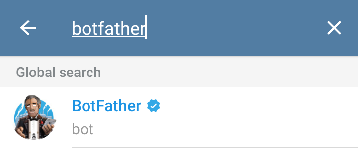
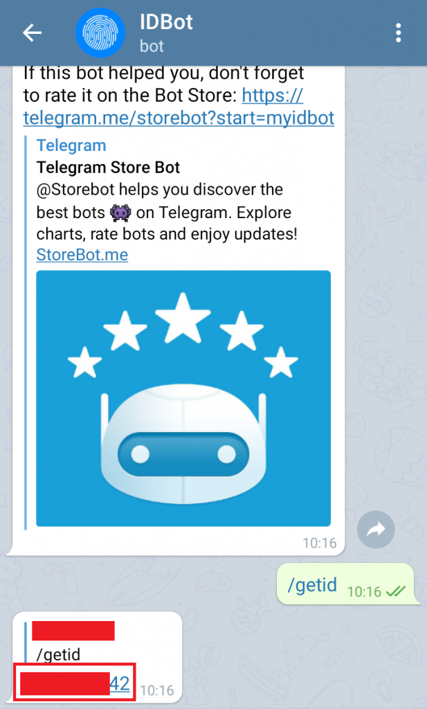

# ESP8266 IoT Telegram

## Description:

- Telegram is a chat messaging application that allows users to send secret chat messages that are end-to-end encrypted for added security. The Telegram chat application has a clean interface and has various features, one of which can be used for IoT.

## Steps to Set Up a Telegram Bot

- First install the ArduinoJson and CTBot libraries on the Arduino IDE via the Library Manager.  
- On Telegram, search for BotFather.  
   

- Open BotFather > click Start > type /newbot > name the bot > give the bot a username > Save the token given to be entered into the program later. To enter the newly created bot, you can click the link given in the section after "You will find it at ...", and once you are in you can type /start.  
   
- New bot creation image.  

   

- Image of the token obtained

- After that, we need our Telegram ID by: searching for IDBot > clicking Start > typing /getid.
   
- Telegram ID image obtained

## Component (Tools & Materials):

- NodeMCU ESP8266 = 1 unit;

## Interface:

 

## Conclusion:

- In this project, NodeMCU ESP8266 will send a “Hello from Indobot” message to our telegram.
